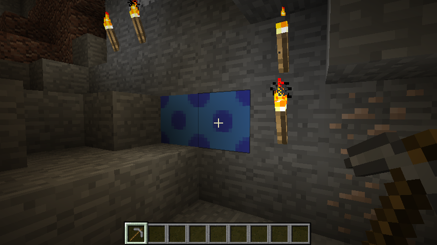
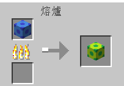

# IceHard

這是我和 hokomili 做的 Minecraft MOD，支援 Minecraft 1.12.2

## 功能

這個 MOD 會增加一種礦物，叫做「冰硬」，英文是「Ice Hard」

冰硬是種奇特的金屬，它會吸收全部的熱能，因此溫度永遠保持在絕對零度。
用手摸冰硬，保證會讓你的手凍傷，因此你必須用石鎬 (或者更高級的鎬) 來挖掘

冰硬的顏色是由它吸收的熱能決定的，把冰硬拿去熔爐烤，就會改變顏色。要利用冰硬吸收的能量，就要把銅和冰硬融合，因為當冰硬和銅融合時，冰硬會釋放出它吸收的熱

冰硬還可以做成劍，攻擊力還不錯，而且由於冰硬的質能互換特性，快要壞掉的冰硬劍可以放到熔爐裡烤，然後就變得跟新的一樣了

## 去哪找冰硬

在地底深處，大概和鐵礦同樣的深度就找的到

## 公式表

* 改變冰硬的顏色需要把冰硬拿去熔爐烤  

* 在工作臺上，融合 8 個藍色冰硬和 1 個銅粒就會得到 8 個能量堆，能量堆就是冰硬吸收的能量

* 把一個不是藍色的冰硬放到工作台上就會變成 n 個藍色冰硬，n 等於多少請自行摸索

* 能量堆可以做為熔爐的燃料，1 個能量堆 = 烤一次東西

* 把兩個冰硬（一定要同樣顏色）和一個銅拿去合成就可以做出冰硬劍

### 等等，哪裡來的銅？
* 因為 Minecraft 沒有內建的銅，所以我們的 Mod 提供一個合成銅的方法：4 個鐵錠 + 1 個金錠 = 5 個銅
* 1 個銅加上 1 個鐵粒就會變成 16 個銅粒
* 無法把這個 Mod 的銅粒變回銅
